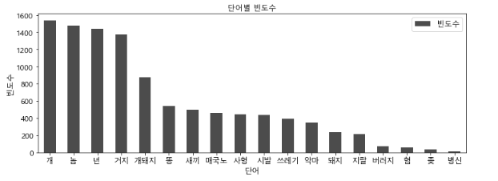
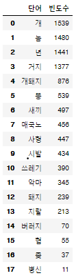
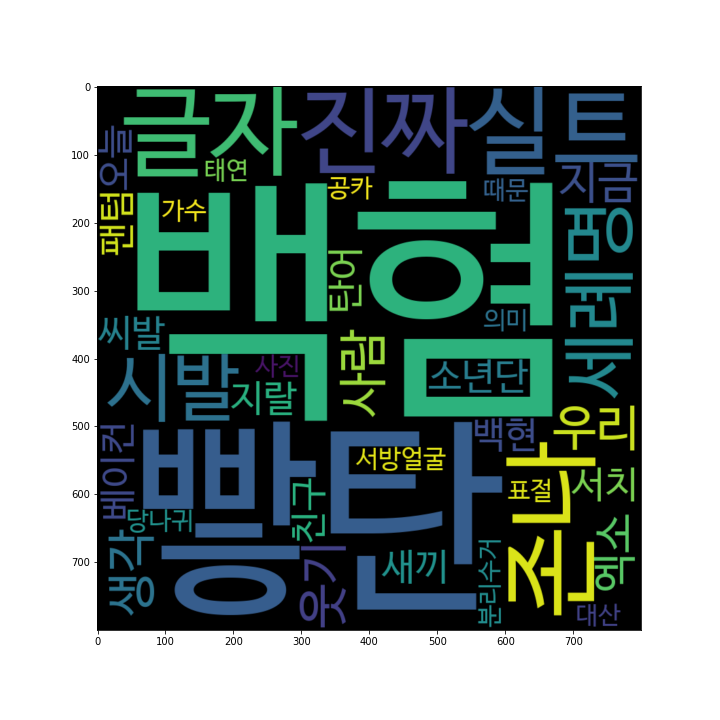

# 악플타파 프로젝트

DSC 해커톤 에서 악플 분류 및 정제 프로젝트를를 수행하여 1등이라는 좋은 결과를 이뤄냈습니다.

사용 기술스택: **python3.6, wordclod, KRWordRank, KoNLPy, Selenium, matploblib, pandas**

Selenium 을 활용하여 각종 기사 댓글과 트위터 글들을 집중적으로 크롤링해왔습니다. 이미 많은 서비스들이 비속어를 노출시키지 않게끔 하고있었기 때문에, 충분히 비속어들이 모아지지 않아서,
트위터의 특정 사건에 관련된 키워드들을 포함하고 있는 글들을 모아 조금 더 결과가 두드러지게 나오도록 프로젝트를 진행했습니다.

koNLPy 와 정규표현식을 활용해 크롤링한 글들을 정제했고,

matploblib, pandas, wordcloud 를 활용해 비속어와 그 빈도수를 그래프로 시각화 하였습니다.

### 발표자료:
<a href="악플타파.pdf">발표자료</a>

